[github.com/sanvidvaidya](https://github.com/sanvidvaidya)

> Systems engineer & product builder. 
> Deterministic architectures over stochastic guesses.

I build explainable, deterministic systems that turn complex organizational intent 
and healthcare data into traceable, verifiable intelligence. Focused on systems 
reasoning, clinical knowledge graphs, and decision-support engines.

<samp>typescript &nbsp; python &nbsp; javascript &nbsp; react &nbsp; fastapi &nbsp; streamlit &nbsp; sqlite &nbsp; postgres &nbsp; docker &nbsp; git &nbsp; linux</samp>

**[TRACE](https://github.com/sanvidvaidya/TRACE)** &nbsp;·&nbsp; <samp>typescript, react, 3d physics</samp> 
Deterministic systems reasoning and requirements engineering engine that 
transforms ambiguous organizational intent into traceable, testable architectures.

**[healthgraph](https://github.com/sanvidvaidya/healthgraph)** &nbsp;·&nbsp; <samp>typescript, fhir</samp> 
Deterministic clinical intelligence platform and FHIR knowledge graph explorer 
that validates healthcare schemas, resolves references, and delivers real-time CDS.

**[enterprise-decision-intelligence-simulator](https://github.com/sanvidvaidya/enterprise-decision-intelligence-simulator)** &nbsp;·&nbsp; <samp>python, streamlit</samp> 
Local, explainable SaaS renewal-risk decision-support system using SQLite, 
pandas, and deterministic business rules.

**[lifemap](https://github.com/sanvidvaidya/lifemap)** &nbsp;·&nbsp; <samp>typescript, react</samp> 
Privacy-first personal analytics application that transforms local activity data 
into a deterministic RPG world.

**[ai-product-research-system](https://github.com/sanvidvaidya/ai-product-research-system)** &nbsp;·&nbsp; <samp>python, prompt engineering</samp> 
AI-driven product research, competitive analysis, and PRD generation workflow.

Every graphic here is generated, not embedded from anyone else's server. 
`ascii.svg` is a photo pushed through a character ramp by 
[`scripts/make_portrait.py`](scripts/make_portrait.py); the stat graphics and 
these section headings are drawn by [a scheduled action](.github/workflows/stats.yml) 
straight from the GitHub GraphQL API, once a day, committing only what changed.

They animate with SMIL inside the SVG, because GitHub strips scripts from 
READMEs — and since nothing loads from a third party, nothing here can 
rate-limit or go dark. The headings are SVGs for the same reason: GitHub also 
strips CSS, so an image is the only way to put this page's own typeface on them.

The typeface is [JetBrains Mono](scripts/fonts), subset to just the characters 
each graphic draws and inlined as base64. That isn't only for looks: the 
portrait's grid assumes an advance width of exactly 0.600 em, and a viewer whose 
default monospace is narrower would otherwise see it squeezed.

Language totals cover public repositories only. `year.svg` uses the portrait's 
character ramp: `:` `+` `#` `@`, quiet to loud.
